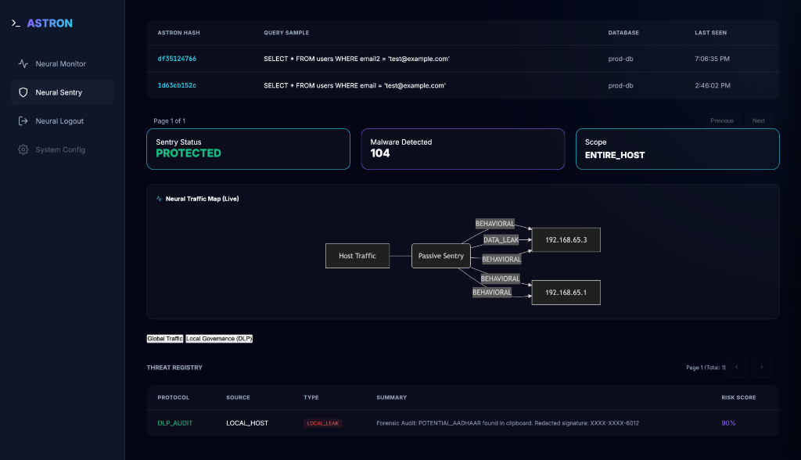
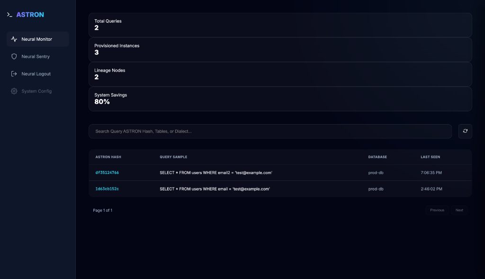
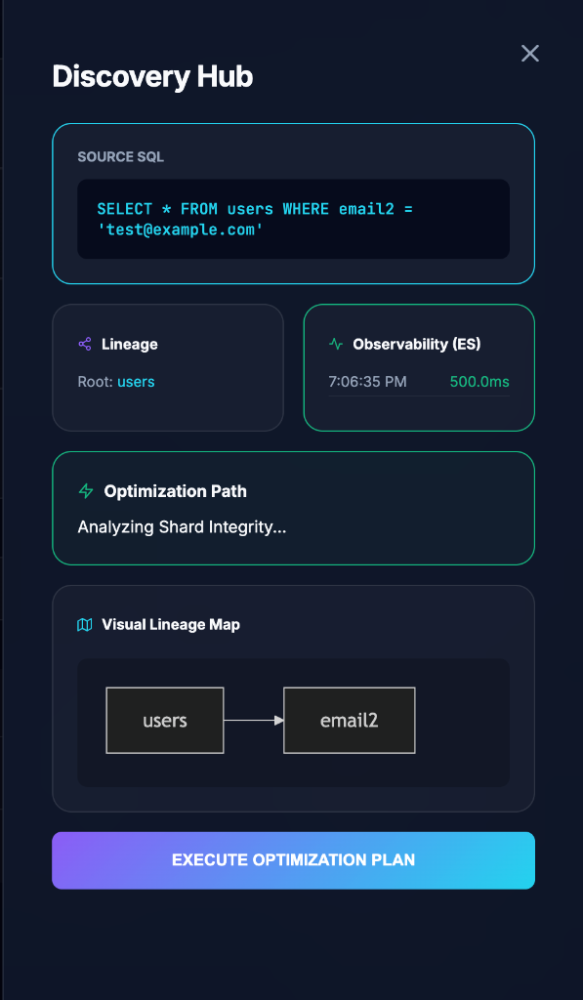

# ASTRON | Advanced SQL Intelligence Platform

> [!NOTE]
> **Project Status: WIP (Pet Project)**
> ASTRON is an active experimental project specializing in high-performance SQL observability and sidecar security architectures. Featuring a **Grammar-First** AST engine, it moves beyond naive pattern matching to provide professional-grade tactical analysis.

---

## 🚀 The Scenario: Why ASTRON?

Most SQL analyzers fail on **nested queries, aliases, and formatting variations**. They "count things" using naive string matching. ASTRON treats SQL as a language, not a string.

| Feature | Naive Analyzers | ASTRON (v8.0) |
|---|---|---|
| **Nested Queries** | ❌ Fails on sub-scopes | ✅ Recursive AST Traversal |
| **Alias Resolution** | ❌ Loses context | ✅ Full Alias Qualification |
| **Intelligence** | ❌ Simple counts | ✅ Tactical Forensic Advice |
| **Ingestion** | ❌ Single Request | ✅ Batch & File-Based Pipeline |

---

## 🖼️ Interface Highlights

### 1. Neural Sentry Hub (Security Ops)
The Sentry Hub provides a real-time view of all network traffic, including an interactive Mermaid-driven traffic map and the forensic threat registry.


### 2. Forensic Sentry (DLP & Behavior)
Real-time detection of high-entropy payloads and sensitive PII leaks across the network mesh.


### 3. Neural Monitor (Performance Ops)
Track global query metrics, deduplicated hashes, and provisioned instance health across your entire decentralized infrastructure.


### 4. Discovery Hub (Lineage & Tactical Advice)
Drill down into specific queries to visualize SQL lineage and receive **Expert Tactical Advice**.


---

## 🏗️ Architectural Vision: Grammar-First Observability

### 1. The Expert Lineage Engine
ASTRON leverages `sqlglot.optimizer.qualify` to expand `SELECT *`, resolve complex table aliases, and handle Recursive CTEs. This ensures 100% accurate column mapping even in queries with 10+ joins.

### 2. The Tactical Warden
Instead of just counting "Joins" or "Where clauses," ASTRON audits the AST for performance and security anti-patterns:
- **Index Suppression**: Flagging `UPPER(col)` or `DATE(col)` in filters that break index seeks.
- **Wildcard Bloat**: Detects `SELECT *` patterns.
- **Security Tautologies**: Flags redundant `1=1` logic.
- **Cartesian Risk**: Detects joins missing explicit criteria.

---

## 📥 Ingestion Flexibility (Omni-Ingest)

ASTRON v8.0 introduces native support for high-volume batch processing:
- **Batch Processing**: Splitting monolithic multi-statement strings into individual telemetry samples using `sqlglot.split_queries`.
- **File Ingest**: Upload `.sql` dumps directly to `POST /v1/telemetry/queries/file` for instant forensic auditing.

---

## 🚀 QuickStart (3 Minutes)

1.  **Boot the Mesh**: 
    ```bash
    docker-compose up -d
    # Services: Postgres, Redis, MinIO, Elasticsearch, Gateway, Workers
    ```
2.  **Provision Your Instance**: 
    Register an Organization and receive your Enterprise Access Token via the UI or `POST /v1/onboarding/register`.
3.  **Run the Forensic Demo**:
    ```bash
    pip install -r requirements.txt
    python3 exporters/demo_exporter.py
    ```
4.  **View UI**: Open `frontend/index.html`. All metrics and tactical insights are now live.

---

## 🛡️ Security & Privacy
ASTRON is built with a **Privacy-First** architecture:
- **Masked Signatures**: Only redacted forensic signatures (e.g., `XXXX-XXXX-1234`) are stored.
- **Passive Sniffing**: Zero-overhead network auditing that does not intercept application-level sensitive memory.
- **Least Privilege**: Designed to run as a sidecar with zero-trust credentials.

---

## ⚖️ License
Licensed under the [Apache License 2.0](LICENSE).

---
**Author:** [Ashutosh]